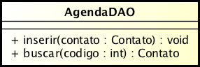
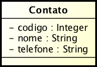

Neste exercício gostaria que você criasse um cache para uma classe que busca arquivos em XML.

Você vai usar o padrão Decorator para essa tarefa, ou seja, não irá alterar a classe que acessa o arquivo.

O sistema possui uma classe AgendaDAO que insere e busca os dados do arquivo. Veja abaixo como deve ser essa classe:

E a classe Contato:

O funcionamento é bem simples, para salvar um novo Contato você irá passá-lo no método inserir de AgendaDAO. E para buscar um, passe o código.

OBS: Se você quiser implementar essa busca em banco de dados, fique a vontade. O importante é ter acesso a uma fonte de dados externa.

A classe CacheAgendaDAO irá decorar a AgendaDAO.

Você irá decorar a inserção e a busca da Agenda, para isso use um map, como abaixo:

Map<Integer, Contato> contatos;
Use a chave do mapa com o código do contato.

Consegue usar o que aprendemos e criar todo esse sistema?

Dica: crie a classe AgendaDAO usando apenas o arquivo e esqueça que existirá cache, depois disso pronto, implemente o Decorator.