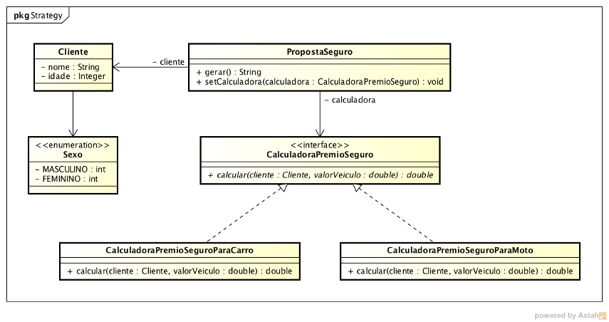

Você foi contratado para criar um sistema que cálcula o prêmio de um seguro.

Na linguagem do seguro, prêmio é o valor que você pagar para ter direito ao seguro.

Você irá criar um sistema iterativo, usando a classe Scanner para receber os dados do usuário.

Veja o diagrama abaixo como devem ser as classes desse sistema:

A sequência deve ser assim:

Peça os dados do cliente
Entre em um loop
Pergunte o tipo do veículo
Crie a instância da calculadora para carro ou moto
Injete essa instância, através do método setCalculadora() em PropostaSeguro
Faça a proposta, chamando o método gerar()
Volte ao início do loop
Veja que com esse exemplo, você irá trocar o algoritmo em tempo de execução.